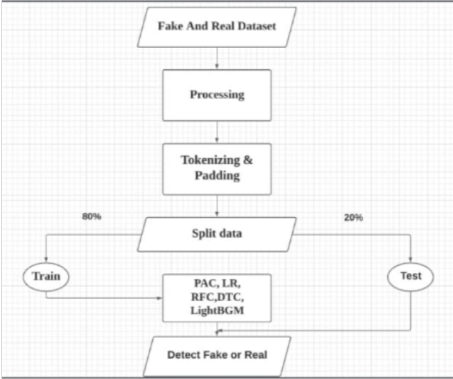
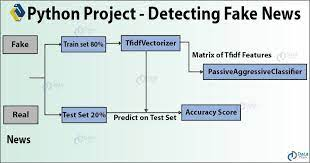
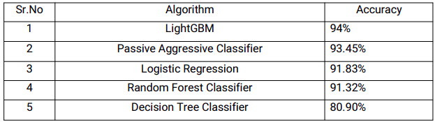
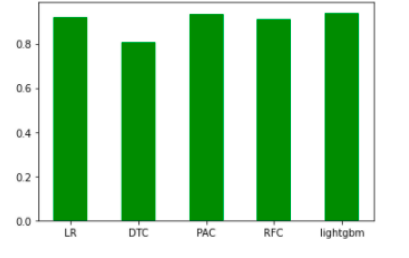

# Fake-News-Detection
Fake News Detection in Python  In this project, we have used various natural language processing techniques and machine learning algorithms to classify fake news articles using libraries like SK-learn from Python.

# Abstract
Social media for news consumption is a double-edgedsword.On one hand,its low cost,easy access,and rapid dissemination of information lead people to seek out and consume news from social media.On the other hand,it enables the wide spread of“fake news”,i.e.,low quality news with intentionally false information.The extensive spread of fake news has the potential for extremely negative impacts on a individual and society.Therefore,fake news detection on social media hasrecently become an emerging research that is attracting tremendous attention.Fake news detection on social media presents unique  characteristics and challenges that make existing detection algorithms from  traditional news media in effective or not applicable. The purpose of the work is to come up with a solution that can be utilized by users to detect and filter out sites containing false and misleading information. We use simple and carefully selected features of the title and post to accurately identify fake posts.

# Result

# Dependencies/Software

<li>Python</li>
<li>Numpy</li>
<li>Sklearn</li>
<li>pandas</li>
<li>tfid vectorizer</li>
<li>Django</li>
<li>Vs Code</li>
<li>Jupyter Notebook / Google Colab</li>

# HOW TO RUN THE PROJECT

Email me at yashsarda003@gmail.com to get a any querry report related with Code.

STEPS=>

1.Clone the repository 

2.Make sure you have all the required libraries already installed.

3.Open terminal and make sure the directory which you are in has manage.py file or not.

4.If you are windows user type in command prompt => python manage.py runserver.

5.If you are a linux user type in termnial => python3 manage.py runserver.

6.Please Extract this file at path (Otherwise the project will throw an error)=> fake_news/model/fake_or_real_news.tar.xz

# Dataset

 Click on the download link to download the dataset. 

<a href="dataset/fake_or_real_news.zip"> Download</a>

# DFD Diagram

# Model Architecture

# Result
### ResultsandDiscussion:-
Let’s submarize the accuracy achieved by each algorithm through the following table:

The graph below submarizes the average accuracy of all algorithms on follwing dataset:

